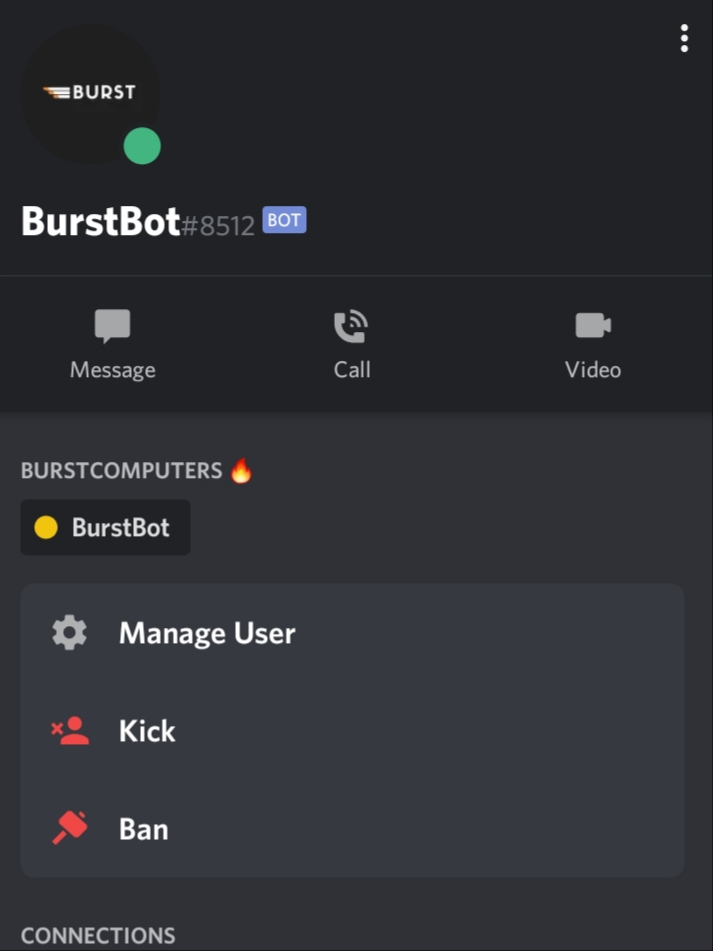
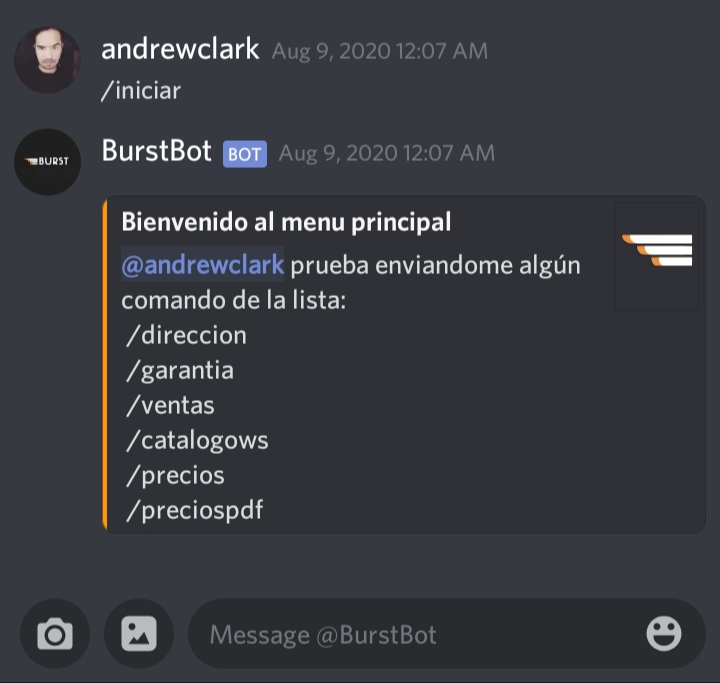

# BurstBot Discord
Repositorio para nuestro bot en el servidor oficial de Discord.

## Comenzando 🚀

_Enlace directo al_ [Servidor](https://discord.gg/TXDrcTw)


### ¿Que hace el bot? 📋
Las principales funcionalidades son:

* Contar la cantidad de usuarios en el servidor
* Saludar a nuevos miembros del servidor
* Respuesta de comandos en formatos:
    * Texto
    * Imagenes
    * Embeds
    * Archivos en Buffer
    * Links
* Moderación del servidor:
  * Si los usuarios inclumplen las normas y políticas establecidas el bot puede:
    * Advertir sobre incumplimiento de normas
    * Eliminar mensajes 
    * Eliminar usuarios
* Integrarse con redes sociales a través de webhooks


### Comunicarse con el bot 
 
Una vez dentro del servidor, se debe ubicar el bot entre la lista de usuarios conectados, el cuál tiene el siguiente perfil:




Una vez ubicado, se debe entrar a la mensajería privada y enviar el comando:

```
/iniciar
```

eso empezará la interacción con el bot:




## Construido con 🛠️

* [Node.JS](https://nodejs.org/en/) - Entorno que ejecuta codigo _server-side_ Javascript.
* [Discord.JS](https://discord.js.org/#/) - Módulo de Node que facilita la interacción con la API de Discord a través de un ambiente de programación orientado a objetos 
* [IFTTT](https://ifttt.com/) - Servicio de conexión de apps a través de webhooks


### Deployment 📦

* Cuenta verificada en Heroku


## Versionado 📌

[GitHub](https://github.com/) para el versionado.
[Heroku](https://www.heroku.com/) para el deployment de la aplicación.

## Autores ✒️


[Andrew Clark](https://github.com/andrewxxclark) y [Hector Cese](https://github.com/HackThorD) - desarrollo oficial para  *Burst Computers* 
